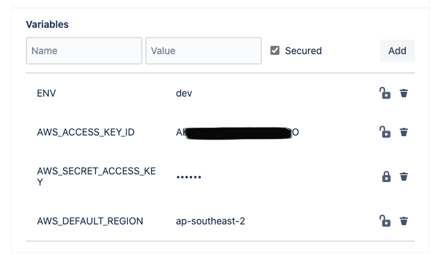
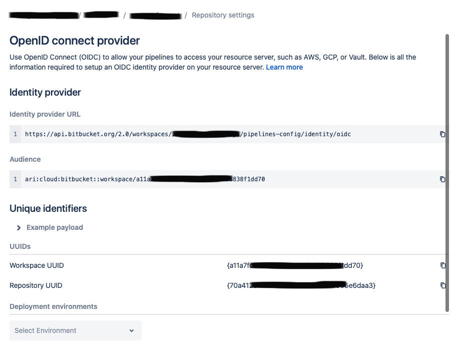
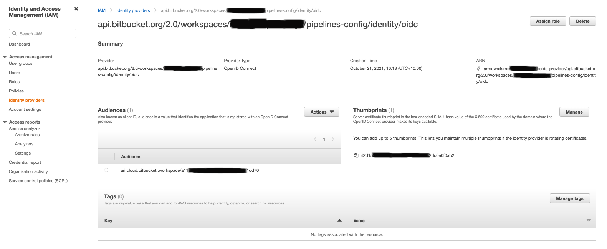
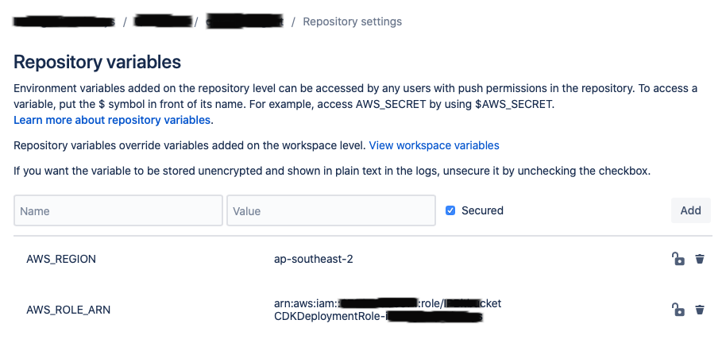

# Deploying to AWS using Bitbucket Pipelines

Any CI/CD pipeline that deploys resources into AWS will be required to provide credentials during the execution of the pipelines.

When using a pipeline like AWS CodePipeline, it's native integration into AWS using IAM Roles provides this transparent entry into AWS.

Intelligent Pathways, and many of our clients, use Atlassian Bitbucket and Bitbucket Pipelines for deploying our AWS infrastructure and application.

As this executes outside of our AWS environment, we need to provide credentials to be used by the pipeline to deploy into AWS.

A standard approach to this would be to:
1. Create an IAM user in the target AWS Account
2. Grant suitable permissions to that IAM User (or via a Group) to enable it to deploy the resources
3. Create security credentials (Access keys)
4. Record these Access/Secret keys somewhere secure
5. Add them as Repository/Deployment variables in the Bitbucket Repository Settings.



While the above process achieves the desired goal, it has a high level of setup overhead, as well as increased security risk profile.

A review of AWS Identity and Access Management best practices (found [here](https://docs.aws.amazon.com/IAM/latest/UserGuide/best-practices.html)) highlights some of the shortcomings of the above approache:
1. Use roles to delegate permissions where possible
2. Do not share access keys
3. Rotate credentials regularly
4. Use policy conditions for extra security

## OIDC (OpenID Connect) Federation to the Rescue

### What is OpenID Connect?

The following is taken straight from the [https://openid.net](https://openid.net/connect/) website:

> OpenID Connect 1.0 is a simple identity layer on top of the OAuth 2.0 protocol. It allows Clients to verify the identity of the End-User based on the authentication performed by an Authorization Server, as well as to obtain basic profile information about the End-User in an interoperable and REST-like manner.

Both Bitbucket Pipelines and AWS IAM support OIDC authentication flows.

At a high level, to avoid the use of IAM Access keys we will setup a trust relationship between Bitbucket Pipelines and AWS IAM in the target AWS Account.

This involves the following steps:
1. Lookup the Bitbucket Pipelines OIDC provider url and audience in your repository settings.
2. Register a new AWS IAM Identity Provider
3. Create a new AWS IAM Role that will be used by the pipeline for deployment into AWS
    * IAM Role is configured to be assumed only by the federated OIDC Identity Provider
    * IAM Role can only be assumed from one of the IP Addresses used by Bitbucket Pipelines


#### Bitbucket OpenID Connect

The OpenID Connect settings can be found under the Repository Settings.

Note: The "Identity provider URL" and "Audience" will be identical for all Repositories in the same Bitbucket Workspace.



#### AWS IAM Identity Provider

Now that we have the "Identity provider URL", we can set up an OpenID Connect Identity provider in AWS IAM.

Whilst this could be done using "click ops", we will deploy this using AWS CDK.

The code snippets below show the relevant parts of the cdk project.

The OpenIdConnectProvider shown below is a CDK construct that will use a Lambda function to create the OpenID Connect Provider:

```typescript
//lib/aws-bitbucket-stack.ts
import * as cdk from '@aws-cdk/core';
import * as iam from '@aws-cdk/aws-iam';

export interface AWSBitbucketStackProps extends cdk.StackProps {
  readonly bitBucketProviderUrl: string,
  readonly bitBucketClientIds: string[]
  readonly bitBucketOIDCThumbprints: string[]
}
export class AWSBitbucketStack extends cdk.Stack {
  constructor(scope: cdk.Construct, id: string, props: AWSBitbucketStackProps) {
    super(scope, id, props);

    const provider = new iam.OpenIdConnectProvider(this, 'BitBucketProvider', {
      url: props.bitBucketProviderUrl,
      clientIds: props.bitBucketClientIds,
      thumbprints: props.bitBucketOIDCThumbprints
    });
  }
}

```

This stack will be created by the main cdk app file:

```typescript
#!/usr/bin/env node
import 'source-map-support/register';
import * as cdk from '@aws-cdk/core';
import * as fs from "fs";

const workspaceEnvironment: string = (process.env.DEPLOY_ENVIRONMENT || 'bitbucket').toLowerCase();

const configJson = fs.readFileSync(`config/${workspaceEnvironment}.json`, 'utf8');
const config = JSON.parse(configJson);

import { AWSBitbucketStack } from '../lib/aws-bitbucket-stack';

const app = new cdk.App();

//This stack gets created once per AWS account
new AWSBitbucketStack(app, 'AWSBitbucketStack', {
    stackName: `AWSBitbucketStack-${config.workspace}`,
    bitBucketProviderUrl: config.identityProviderUrl,
    bitBucketClientIds: config.identityProviderAudiences,
    bitBucketOIDCThumbprints: config.identityProviderThumbprints,
    env: {
        account: process.env.CDK_DEFAULT_ACCOUNT,
        region: process.env.CDK_DEFAULT_REGION,
    },
});


```

This loads up the configuration from a JSON file:

```json
{
  "workspace": "<this is your bitbucket workspace>",
  "identityProviderUrl": "https://api.bitbucket.org/2.0/workspaces/<this is your bitbucket workspace>/pipelines-config/identity/oidc",
  "identityProviderAudiences": [
        "ari:cloud:bitbucket::workspace/<your audience from Bitbucket OIDC configuration>"
  ],
  "identityProviderThumbprints": []
}
```

Finally, deploy this stack using CDK:

```shell
cdk bootstrap --toolkit-stack-name cdk-bitbucket-oidc
cdk deploy --toolkit-stack-name cdk-bitbucket-oidc AWSBitbucketStack
```

This will create a CloudFormation Stack with the required resources.  The end result is the OpenID Connect provider created in your AWS Account:




## IAM Deployment Roles

Now that we have the IAM OpenID Connect Identity Provider configured, we can start creating some IAM Roles that will be used by the Pipelines.

The following shows how we would deploy one of these roles using CDK:

```typescript
import * as cdk from '@aws-cdk/core';
import * as iam from '@aws-cdk/aws-iam';
import {Effect, ManagedPolicy, PolicyStatement} from "@aws-cdk/aws-iam";

export interface AWSBitbucketDeploymentRoleStackProps extends cdk.StackProps {
  readonly workspace: string,
}
export class AWSBitbucketDeploymentRoleStack extends cdk.Stack {
  constructor(scope: cdk.Construct, id: string, props: AWSBitbucketDeploymentRoleStackProps) {
    super(scope, id, props);

    const bbFederatedPrincipal = `arn:aws:iam::${this.account}:oidc-provider/api.bitbucket.org/2.0/workspaces/${props.workspace}/pipelines-config/identity/oidc`;

    const deploymentRole = new iam.Role(this, 'CDKDeploymentRole', {
      roleName: `BitbucketCDKDeploymentRole-${props.workspace}`,
      assumedBy: new iam.FederatedPrincipal(bbFederatedPrincipal, {
        "IpAddress": {
          "aws:SourceIp": [
            "34.199.54.113/32",
            "34.232.25.90/32",
            "34.232.119.183/32",
            "34.236.25.177/32",
            "35.171.175.212/32",
            "52.54.90.98/32",
            "52.202.195.162/32",
            "52.203.14.55/32",
            "52.204.96.37/32",
            "34.218.156.209/32",
            "34.218.168.212/32",
            "52.41.219.63/32",
            "35.155.178.254/32",
            "35.160.177.10/32",
            "34.216.18.129/32",
            "3.216.235.48/32",
            "34.231.96.243/32",
            "44.199.3.254/32",
            "174.129.205.191/32",
            "44.199.127.226/32",
            "44.199.45.64/32",
            "3.221.151.112/32",
            "52.205.184.192/32",
            "52.72.137.240/32"
          ]
        }
      }, "sts:AssumeRoleWithWebIdentity")
    });

    // allow Read Only for EVERYTHING
    deploymentRole.addManagedPolicy(ManagedPolicy.fromManagedPolicyArn(this, 'ReadOnlyAccess', 'arn:aws:iam::aws:policy/ReadOnlyAccess'));

    // now allow pretty much everything else as long as via Cloudformation
    const deployViaCloudFormationStatement = new PolicyStatement({
      resources: ['*'],
      actions: ['*'],
      effect: Effect.ALLOW,
      conditions: {
        "ForAnyValue:StringEquals": {
          "aws:CalledVia": ["cloudformation.amazonaws.com"]
        }
      }
    });
    deploymentRole.addToPolicy(deployViaCloudFormationStatement);

    // we need this to allow cdk to bootstrap AND then upload artifacts to the bootstrap buckets (As long as they match this naming pattern!)
    const deployResourcesToCDKStagingStatement = new PolicyStatement({
      resources: ['arn:aws:s3:::cdk-*stagingbucket-*'],
      actions: [
        's3:*',
      ],
      effect: Effect.ALLOW
    });
    deploymentRole.addToPolicy(deployResourcesToCDKStagingStatement);

    // we need this to allow cdk to bootstrap AND then upload artifacts to the bootstrap buckets (As long as they match this naming pattern!)
    const deployCDKCloudFormationStackStatement = new PolicyStatement({
      resources: ['*'],
      actions: [
        'cloudformation:ValidateTemplate',
        'cloudformation:DescribeStacks',
        'cloudformation:CreateChangeSet',
        'cloudformation:DescribeChangeSet',
        'cloudformation:ExecuteChangeSet',
        'cloudformation:DescribeStackEvents',
        'cloudformation:DeleteChangeSet',
        'cloudformation:GetTemplate',
      ],
      effect: Effect.ALLOW
    });
    deploymentRole.addToPolicy(deployCDKCloudFormationStackStatement);

    // allow Read only for all CodeArtifact
    deploymentRole.addManagedPolicy(ManagedPolicy.fromManagedPolicyArn(this, 'AWSCodeArtifactReadOnlyAccess', 'arn:aws:iam::aws:policy/AWSCodeArtifactReadOnlyAccess'));

    // we need this to allow cdk to bootstrap AND then upload artifacts to the bootstrap buckets (As long as they match this naming pattern!)
    const deployCodeArtifactDeploymentStatement = new PolicyStatement({
      resources: ['*'],
      actions: [
        "codeartifact:DisassociateExternalConnection",
        "codeartifact:AssociateWithDownstreamRepository",
        "codeartifact:GetPackageVersionReadme",
        "codeartifact:PutRepositoryPermissionsPolicy",
        "codeartifact:ListTagsForResource",
        "codeartifact:DeletePackageVersions",
        "codeartifact:ListRepositoriesInDomain",
        "codeartifact:DescribePackageVersion",
        "codeartifact:GetDomainPermissionsPolicy",
        "codeartifact:DisposePackageVersions",
        "codeartifact:ListPackageVersionDependencies",
        "codeartifact:TagResource",
        "codeartifact:GetAuthorizationToken",
        "codeartifact:ListPackages",
        "codeartifact:ReadFromRepository",
        "codeartifact:GetPackageVersionAsset",
        "codeartifact:UntagResource",
        "codeartifact:DescribeRepository",
        "codeartifact:ListPackageVersionAssets",
        "codeartifact:DescribeDomain",
        "codeartifact:AssociateExternalConnection",
        "codeartifact:UpdateRepository",
        "codeartifact:CopyPackageVersions",
        "codeartifact:PutPackageMetadata",
        "codeartifact:DeleteRepository",
        "codeartifact:UpdatePackageVersionsStatus",
        "codeartifact:GetRepositoryEndpoint",
        "codeartifact:PublishPackageVersion",
        "codeartifact:GetRepositoryPermissionsPolicy",
        "codeartifact:ListPackageVersions",
        "codeartifact:PutDomainPermissionsPolicy"
      ],
      effect: Effect.ALLOW
    });
    deploymentRole.addToPolicy(deployCodeArtifactDeploymentStatement);
  }
}

```

Some important parts of the details above:

1. The 'CDKDeploymentRole' can only be assumed by the Bitbucket OIDC Federated Principal
2. The 'CDKDeploymentRole' can only be assumed if the requests are coming from one of the listed IP Addresses.
3. It grants ReadOnly to ALL resources.  This is required if CDK or your pipeline needs to perform lookups (e.g. VPCs)
4. It grants the ability to deploy any resource as long as it's done via CloudFormation
5. It grants access to the S3 bucket setup by bootstrapping your CDK toolkit
    * Assumes the toolkit followings the naming pattern: "cdk-*stagingbucket*"
6. It grants access to retrieve and publish to AWS CodeArtifact
7. It grants access to create and execute AWS CloudFormation ChangSets/Stacks.
8. It grants access to AssumeRole and PassRole for deploying using CDK v2.

Important: if you copy the above, please review and assess point #4 above and verify this is suitable for your needs!

Note: Bitbucket Pipelines also provides identifiers that can be used to lock down this IAM Role to a particular Repository Pipeline and Deployment Environment.
Assess if this is needed for your own CI/CD setup, however setting up a Role per repository per environment will create substantial overhead in setting up the pipelines.

## Deploying from Bitbucket Pipelines

Now that we have the OIDC Connect Provider, and an IAM Deployment Role we can now configure our pipelines.

1. Add the ARN of the IAM Deployment Role as a Deployment Variable named "AWS_ROLE_ARN"
2. Configure at the Repository or Workspace level the "AWS_REGION" variable (e.g. ap-southeast-2)
3. Update your steps to enable OIDC
4. Configure the required AWS WebIdentity environment variables in the Step.

### Configure the AWS_ROLE_ARN and AWS_REGION




### Enable OIDC for Pipeline Steps

All we need to do to enable OIDC is to add to the following step:

```yaml
oidc: true
```

As per the documentation [here](https://docs.aws.amazon.com/cli/latest/topic/config-vars.html#assume-role-with-web-identity), we simply need to add the "AWS_WEB_IDENTITY_TOKEN_FILE" environment variable.

```yaml
- export AWS_WEB_IDENTITY_TOKEN_FILE=$(pwd)/web-identity-token
- echo $BITBUCKET_STEP_OIDC_TOKEN > $(pwd)/web-identity-token
```

This example shows a complete Step that will perform a npm login to AWS CodeArtifact

```yaml
definitions:
  steps:

    - step: &npm-login
        name: NPM CodeArtifact Login
        oidc: true
        script:
          - export AWS_WEB_IDENTITY_TOKEN_FILE=$(pwd)/web-identity-token
          - echo $BITBUCKET_STEP_OIDC_TOKEN > $(pwd)/web-identity-token
          
          - aws codeartifact login --tool npm --repository $CA_NPM_REPOSITORY --domain $CA_DOMAIN --domain-owner $CA_DOMAIN_OWNER --region $CA_REGION
          - cp ~/.npmrc $BITBUCKET_CLONE_DIR/.npmrc
        artifacts: # Define the artifact containing the .npmrc file with credentials for AWS CodeArtifact.
          - .npmrc
```

The aws cli/sdk base commands (include aws cdk, boto, etc) will now automatically pickup the AWS_ROLE_ARN, AWS_REGION, and AWS_WEB_IDENTITY_TOKEN_FILE variables and perform the AssumeRoleWithWebIdentity call for us.

## Wrap up

With all of the setup above in place, our pipelines are now more secure: there are no more IAM Credentials/secrets required, and the deployment role can only be assumed by Bitbucket Pipelines.

Please take the time to assess if these policies are suitable for your own needs.

